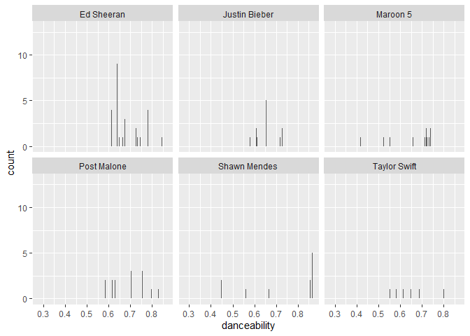

Spotify
================
Fanyi Zeng
2022-05-04

``` r
spotify_songs <- readr::read_csv('https://raw.githubusercontent.com/rfordatascience/tidytuesday/master/data/2020/2020-01-21/spotify_songs.csv')
```

    ## Rows: 32833 Columns: 23

    ## -- Column specification --------------------------------------------------------
    ## Delimiter: ","
    ## chr (10): track_id, track_name, track_artist, track_album_id, track_album_na...
    ## dbl (13): track_popularity, danceability, energy, key, loudness, mode, speec...

    ## 
    ## i Use `spec()` to retrieve the full column specification for this data.
    ## i Specify the column types or set `show_col_types = FALSE` to quiet this message.

``` r
library(tidymodels)
library(corrplot)
```

    ## Warning: package 'corrplot' was built under R version 4.1.3

``` r
library("Hmisc")
```

    ## Warning: package 'Hmisc' was built under R version 4.1.3

What are the variables?

``` r
colnames(spotify_songs)
```

    ##  [1] "track_id"                 "track_name"              
    ##  [3] "track_artist"             "track_popularity"        
    ##  [5] "track_album_id"           "track_album_name"        
    ##  [7] "track_album_release_date" "playlist_name"           
    ##  [9] "playlist_id"              "playlist_genre"          
    ## [11] "playlist_subgenre"        "danceability"            
    ## [13] "energy"                   "key"                     
    ## [15] "loudness"                 "mode"                    
    ## [17] "speechiness"              "acousticness"            
    ## [19] "instrumentalness"         "liveness"                
    ## [21] "valence"                  "tempo"                   
    ## [23] "duration_ms"

There seems to be a lot of song traits that we can make a correlation
table of.

None of the traits seem to be strong indicators of popularity.
Instrumentalness and energy are weak, negative correlates, such that
songs that are purely instrumental or high energy are less popular.

Energy, acousticness, and loudness are strongly correlated with each
other. It is no wonder that higher energy songs are louder songs, since
loudness is one of the features of energy. An example of loud, energetic
songs is death metal. I suppose those songs are more likely to use
electronic sounds, which is the opposite of acousticness (using purely
instruments).

Danceability is moderately correlated with valence and weakly with
speechiness, such that songs that are more danceable are more positive
and has more rap.

``` r
cor<-rcorr(as.matrix(spotify_songs[,c(4,12,13,15,17,18,19,20,21)]))
corrplot(cor$r, type="upper", order="hclust", 
         p.mat = cor$p, sig.level = 0.05, insig = "blank")
```

<!-- -->

I have picked six famous singers I often listen to. It surprises me that
Taylor Swift has fewer tracks that are popular. Maroon 5 and Shawn
Mendes are similar in that they have a “u” shape distribution, such that
they have songs on both ends of popularity. Post has a binomial
distribution around 50 and 90, such that he has many songs that are just
so-so and many that are very popular. Most songs from Justin and Ed are
well recognized.

``` r
spotify_songs %>%
  filter(track_artist=="Justin Bieber" | track_artist=="Taylor Swift" | track_artist=="Post Malone" | track_artist=="Ed Sheeran" | track_artist== "Maroon 5" | track_artist=="Shawn Mendes") %>%
  ggplot(aes(x=track_popularity)) +
  geom_bar()+
  facet_wrap(~track_artist)
```

<!-- -->

Among the six singers I picked, Ed and Shawn have the most danceable
songs.

``` r
spotify_songs %>%
  filter(track_artist=="Justin Bieber" | track_artist=="Taylor Swift" | track_artist=="Post Malone" | track_artist=="Ed Sheeran" | track_artist== "Maroon 5" | track_artist=="Shawn Mendes") %>%
  ggplot(aes(x=danceability)) +
  geom_bar()+
  facet_wrap(~track_artist)
```

<!-- -->

The commonalities among the singers I chose are they have a lot of pop
songs, some edm, and some latin songs. Post might be the outlier here
with more rock, rap, and r&b (I admit that I don’t listen to those as
much). The others are highly similar in terms of genre distribution. If
I analyze all the singers in the list, then I can find out new singers
of potential interests. Now I know (a little more about) how Spotify’s
algorithm works! They always make good “personal” recommendations on
songs/albums/artists. It’s all machine learning.

``` r
spotify_songs %>%
  filter(track_artist=="Justin Bieber" | track_artist=="Taylor Swift" | track_artist=="Post Malone" | track_artist=="Ed Sheeran" | track_artist== "Maroon 5" | track_artist=="Shawn Mendes") %>%
  ggplot(aes(y=track_artist, fill=playlist_genre)) +
  geom_bar(position="fill")
```

<!-- -->

This is a fun dataset! If you know how to dig, you will get more
insights about Spotify and about your music tastes. I believe there is a
lot more to explore (and maybe some cleaning work to do, cuz there are
some duplicate albums). I have already yielded some interesting
insights, so I will stop here, due to time constraint.
